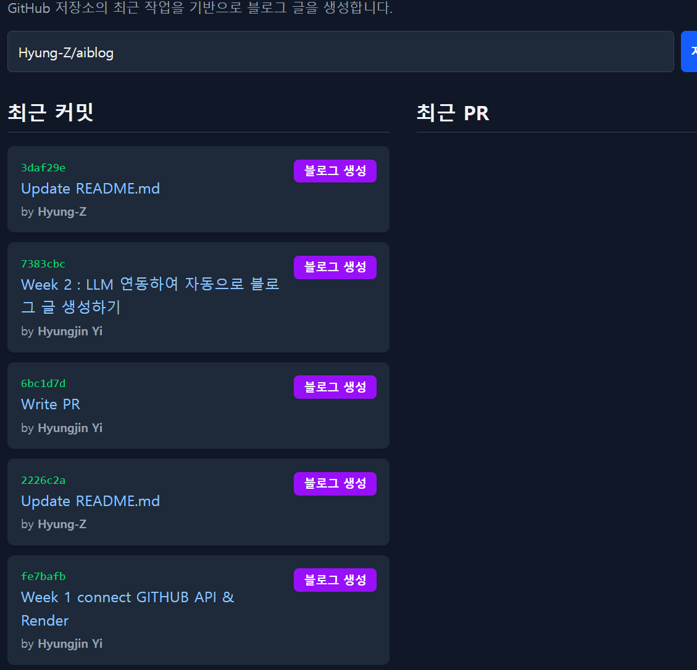
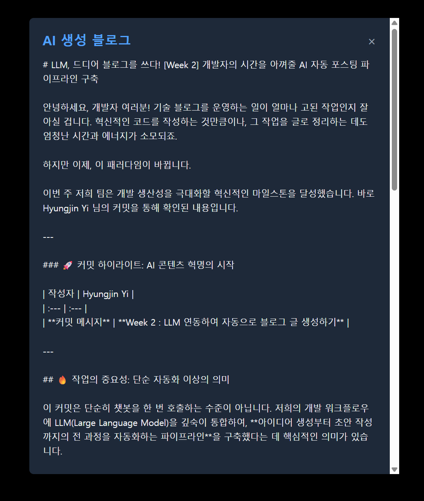

Smart Blog Maker
GitHub 저장소의 커밋/PR 이력을 AI로 요약하여 기술 블로그 초안을 생성해주는 프로젝트입니다.

# 🖥️ 주요 기능 데모

# ✨ 주요 기능
GitHub 데이터 연동: owner/repo 또는 GitHub URL을 입력받아, 해당 저장소의 최근 커밋 및 PR 목록을 실시간으로 조회합니다.

AI 블로그 생성: 각 커밋/PR 항목별 "블로그 생성" 버튼을 클릭하면, Gemini AI가 해당 작업의 내용(커밋 메시지, PR 제목)을 기반으로 기술 블로그 초안을 생성합니다.

보안 API 프록시: React(클라이언트)가 API 키를 직접 노출하지 않도록, Express(서버)가 모든 외부 API(GitHub, Gemini) 요청을 중계합니다.

GITHUB_TOKEN (GitHub API용)

GEMINI_API_KEY (Gemini API용)

인터랙티브 UI:

데이터 로딩 중 스피너 표시

API 에러 발생 시 사용자에게 에러 메시지 표시

생성된 블로그 내용을 깔끔한 모달(Modal) 창으로 제공

# 🛠️ 사용 기술 및 아키텍처

이 프로젝트는 클라이언트와 서버가 분리된 구조로 작동합니다.

Client (React): 사용자의 입력을 받아 Express 서버에 데이터(GET /api/github/...)를 요청합니다.

Server (Express): 클라이언트의 요청을 받아, 서버에만 저장된 GITHUB_TOKEN을 첨부하여 GitHub API에 데이터를 요청합니다.

Client (React): "블로그 생성" 버튼 클릭 시, 커밋/PR 정보를 Express 서버(POST /api/llm/generate)로 전송합니다.

Server (Express): 클라이언트가 보낸 정보를 바탕으로 프롬프트를 생성하고, 서버에만 저장된 GEMINI_API_KEY를 첨부하여 Gemini API에 블로그 생성을 요청합니다.

Client (React): 서버가 반환한 AI 생성 텍스트를 모달 창에 렌더링합니다.

## Client (Frontend)

React.js

Vite (개발 환경 및 번들러)

Tailwind CSS (스타일링)

## Server (Backend)

Node.js

Express (API 라우팅 및 프록시)

dotenv (API 키 등 환경 변수 관리)

cors (CORS 이슈 해결)

node-fetch (Node.js 18 미만 버전의 fetch 지원)

## External APIs

GitHub REST API

Google Gemini API (gemini-2.5-flash-preview-09-2025)

# 🚀 프로젝트 실행 방법
이 프로젝트를 로컬 환경에서 실행하려면 2개의 터미널이 필요합니다.
1. 사전 준비: API 키 발급

GitHub Token: GitHub > Settings > Developer settings > Personal access tokens (Classic)에서 public_repo 권한을 가진 토큰을 발급받습니다.

Gemini API Key: Google AI Studio에서 API 키를 발급받습니다.

2. 프로젝트 클론 및 설정

- 프로젝트를 클론합니다.
git clone https://(여러분의_저장소_주소).git
cd (프로젝트_폴더명)

3. (터미널 1) 📡 서버 실행

server 폴더는 API 요청을 중계하고 모든 API 키를 안전하게 관리합니다.

- server 디렉토리로 이동
cd server

- 의존성 패키지 설치
npm install

- .env 파일 생성 및 API 키 입력
server 폴더 안에 .env 파일을 만들고 발급받은 2개의 키를 입력합니다.

server/.env 파일 내용:

- GitHub 토큰 (ghp_... 또는 gho_... 등)
GITHUB_TOKEN=여러분이_발급받은_GitHub_토큰

- Gemini API 키
GEMINI_API_KEY=여러분이_발급받은_Gemini_API_키

- 서버 실행
node server.js

- ✅ 터미널에 "프록시 서버가 http://localhost:3001 에서 실행 중입니다." 메시지 확인

4. (터미널 2) 💻 클라이언트 실행

client 폴더는 사용자가 보는 React 앱입니다. (서버가 켜져 있는 상태에서 새 터미널을 엽니다.)

- (새 터미널을 열고)
- client 디렉토리로 이동
cd client

- 의존성 패키지 설치
npm install

- React 개발 서버 실행
npm run dev

5. 브라우저 접속

브라우저에서 http://localhost:5173 (Vite가 알려주는 주소)으로 접속하여 '저장소 불러오기' 및 '블로그 생성' 기능을 테스트합니다.

## 📝 추후 구현 계획 (TBD)
[ ] 생성된 블로그 글을 localStorage에 저장하는 기능

[ ] 저장된 블로그 글 목록/상세 보기 페이지 구현

[ ] 블로그 글 편집 기능
