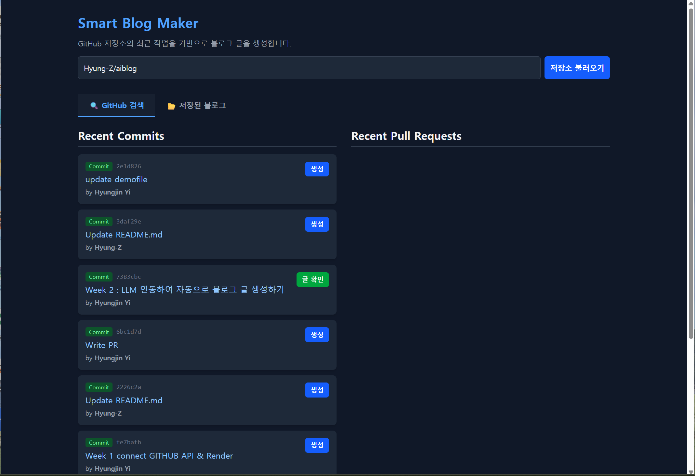
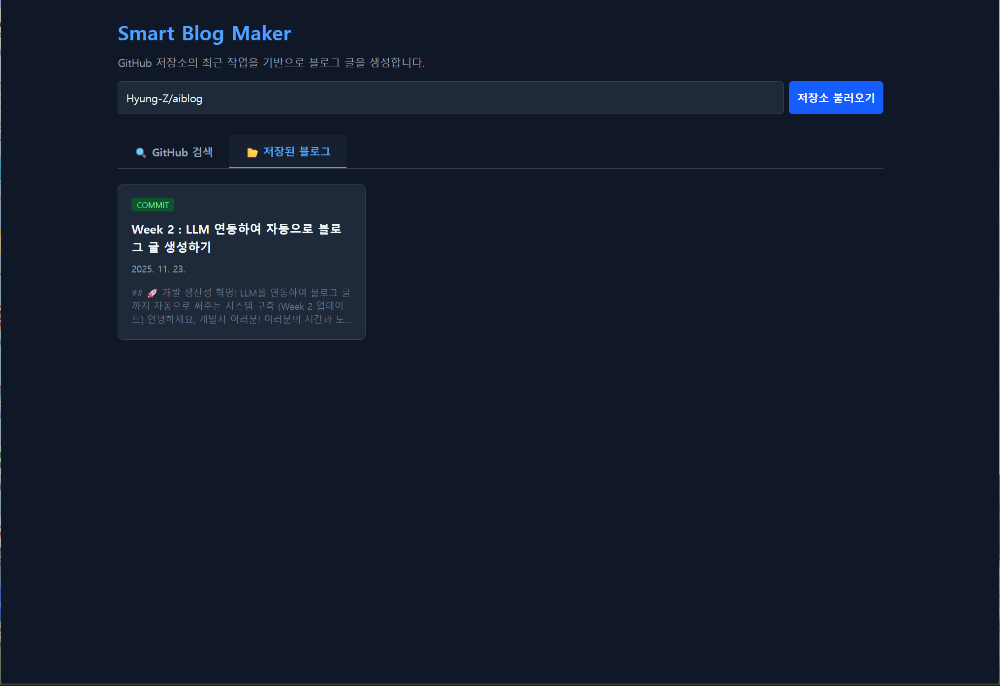

Smart Blog Maker
GitHub 저장소의 커밋/PR 이력을 AI로 요약하여 기술 블로그 초안을 생성해주는 프로젝트입니다.

# 🖥️ 주요 기능 데모

이번 주차에는 서비스의 안정성과 사용자 경험(UX)을 개선하기 위한 대규모 리팩토링과 데이터 영속성(Persistence) 기능을 구현했습니다.

## 전역 상태 관리 도입 (Context API + useReducer)

생성된 블로그 글을 앱 전역에서 효율적으로 관리합니다.

useGitHub, useLLM 등 커스텀 훅(Custom Hooks)을 도입하여 비즈니스 로직과 UI를 분리했습니다.

로컬 스토리지(LocalStorage) 연동

생성된 블로그 글이 브라우저에 자동 저장되어, 새로고침 후에도 데이터가 유지됩니다.

"저장된 블로그" 탭에서 언제든지 이전에 생성한 글을 다시 볼 수 있습니다.

## UX 개선

탭 네비게이션: 'GitHub 검색'과 '저장된 블로그' 탭을 분리하여 깔끔한 UI를 제공합니다.

상태 반영 버튼: 이미 블로그로 생성한 항목은 "생성" 버튼 대신 "✅ 확인" 버튼으로 자동 변경되어 중복 생성을 방지합니다.

비동기 상태 처리: 데이터 로딩, 생성 중, 에러 상태에 따른 정교한 UI 피드백을 제공합니다.

# ✨ 전체 기능 목록

GitHub 연동: 저장소 주소(owner/repo) 입력 시 최근 커밋/PR 목록 실시간 조회

AI 글쓰기: Google Gemini Pro 모델을 활용하여 개발 작업(Commit/PR)을 기술 블로그 톤으로 요약 및 재생성

보안 프록시 서버: Express 백엔드를 통해 API Key(GitHub, Gemini)를 안전하게 은닉하여 호출

블로그 관리:

생성된 글 자동 저장 (LocalStorage)

갤러리 형태의 글 목록 조회

블로그 글 삭제 기능

상세 보기 모달(Modal)

# 🛠️ 기술 스택 및 아키텍처

Client (Frontend)

Framework: React (Vite)

State Management: Context API, useReducer

Styling: Tailwind CSS

Features: Custom Hooks, LocalStorage Sync

Server (Backend)

Runtime: Node.js

Framework: Express.js

Security: dotenv (환경변수 관리), cors

Integrations: GitHub REST API, Google Gemini API

# 🚀 프로젝트 실행 방법
이 프로젝트를 로컬 환경에서 실행하려면 2개의 터미널이 필요합니다.
1. 사전 준비: API 키 발급

GitHub Token: GitHub > Settings > Developer settings > Personal access tokens (Classic)에서 public_repo 권한을 가진 토큰을 발급받습니다.

Gemini API Key: Google AI Studio에서 API 키를 발급받습니다.

2. 프로젝트 클론 및 설정

- 프로젝트를 클론합니다.
git clone https://(여러분의_저장소_주소).git
cd (프로젝트_폴더명)

3. (터미널 1) 📡 서버 실행

server 폴더는 API 요청을 중계하고 모든 API 키를 안전하게 관리합니다.

- server 디렉토리로 이동
cd server

- 의존성 패키지 설치
npm install

- .env 파일 생성 및 API 키 입력
server 폴더 안에 .env 파일을 만들고 발급받은 2개의 키를 입력합니다.

server/.env 파일 내용:

- GitHub 토큰 (ghp_... 또는 gho_... 등)
GITHUB_TOKEN=여러분이_발급받은_GitHub_토큰

- Gemini API 키
GEMINI_API_KEY=여러분이_발급받은_Gemini_API_키

- 서버 실행
node server.js

- ✅ 터미널에 "프록시 서버가 http://localhost:3001 에서 실행 중입니다." 메시지 확인

4. (터미널 2) 💻 클라이언트 실행

client 폴더는 사용자가 보는 React 앱입니다. (서버가 켜져 있는 상태에서 새 터미널을 엽니다.)

- (새 터미널을 열고)
- client 디렉토리로 이동
cd client

- 의존성 패키지 설치
npm install

- React 개발 서버 실행
npm run dev

5. 브라우저 접속

브라우저에서 http://localhost:5173 (Vite가 알려주는 주소)으로 접속하여 '저장소 불러오기' 및 '블로그 생성' 기능을 테스트합니다.
